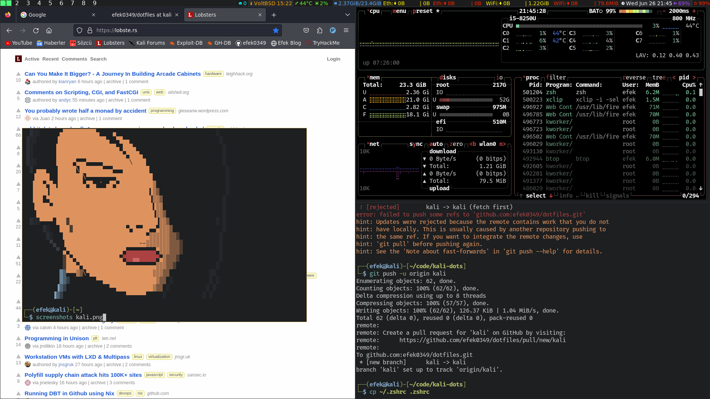

#Thinkpad e480
#Kali-linux
______________________________________________________________________________
|WM/DE|SHELL|TERM |Editor|FileManager|Multiplexer|Audio|Mail|IRC  |Monitor   |
|-----|-----|-----|------|-----------|-----------|-----|----|-----|----------|
|CWM  |ksh  |urxvt|vim   |ranger     |tmux       |cmus |mutt|irssi|conky,dzen|
------------------------------------------------------------------------------

#Screenshots

