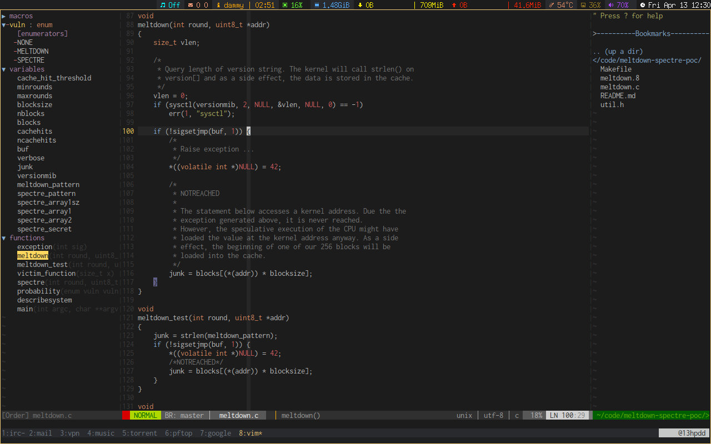
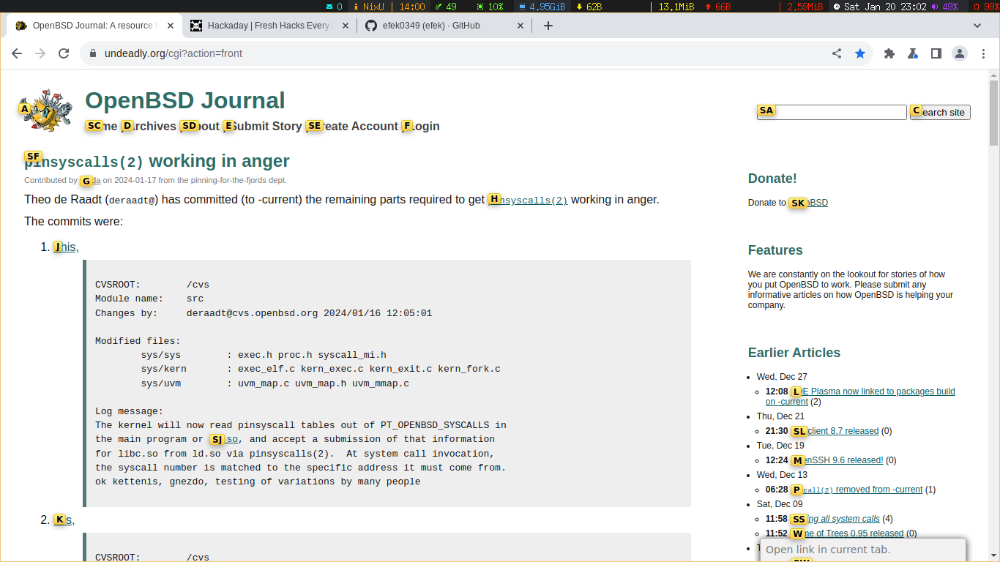

#Thinkpad e480
#OpenBSD-current
______________________________________________________________________________
|WM/DE|SHELL|TERM |Editor|FileManager|Multiplexer|Audio|Mail|IRC  |Monitor   |
|-----|-----|-----|------|-----------|-----------|-----|----|-----|----------|
|CWM  |ksh  |urxvt|vim   |ranger     |tmux       |cmus |mutt|irssi|conky,dzen|
------------------------------------------------------------------------------

#Screenshots

#Mount MFS (622e43df6306aafc.b swap)

\# mkdir /tmp/memarea

\# mount_mfs -s 524288 622e43df6306aafc.b /tmp/memarea

#OpenBSD INSTALL (keydisk)

disk size 256GB(total)

a /          5GB

b swap       4GB

d /tmp       8GB

e /var       10GB

f /usr       6GB

g /usr/X11R6 2GB

h /usr/local 50GB

i /usr/src   4GB

j /usr/obj   4GB

k /home      %100

enter

disk

mounted no

sd1

enter

enter

enter

enter

yes

#ADD: softdep,noatime

622e43df6306aafc.b none swap sw

622e43df6306aafc.a / ffs rw,softdep,noatime 1 1

622e43df6306aafc.k /home ffs rw,softdep,noatime,nodev,nosuid 1 2

622e43df6306aafc.d /tmp ffs rw,softdep,noatime,nodev,nosuid 1 2

622e43df6306aafc.f /usr ffs rw,softdep,noatime,nodev 1 2

622e43df6306aafc.g /usr/X11R6 ffs rw,softdep,noatime,nodev 1 2

622e43df6306aafc.h /usr/local ffs rw,softdep,noatime,wxallowed,nodev 1 2

622e43df6306aafc.j /usr/obj ffs rw,softdep,noatime,nodev,nosuid 1 2

622e43df6306aafc.i /usr/src ffs rw,softdep,noatime,nodev,nosuid 1 2

622e43df6306aafc.e /var ffs rw,softdep,noatime,nodev,nosuid 1 2

622e43df6306aafc.b /tmp/memarea mfs rw,async,-s=524288 0 0

