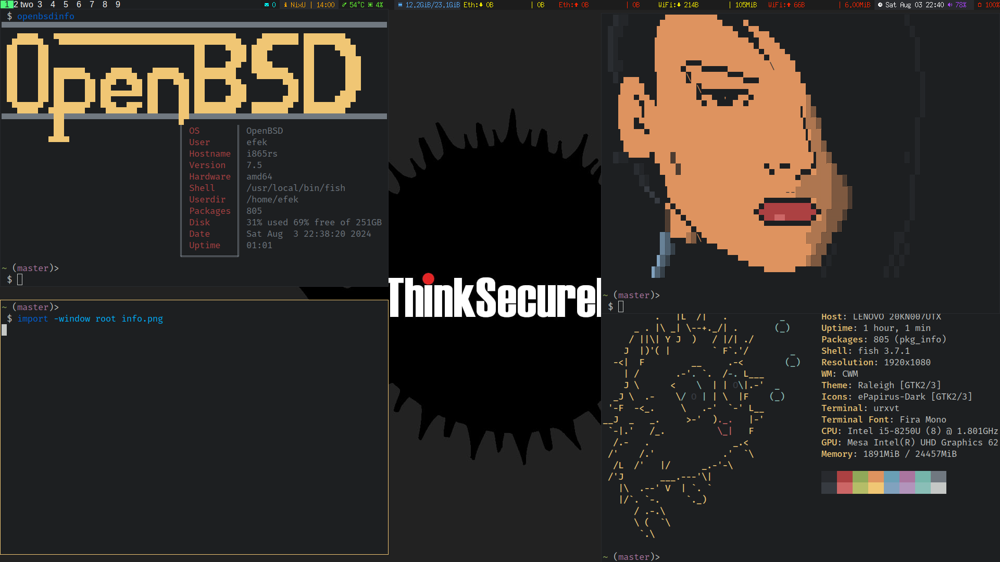
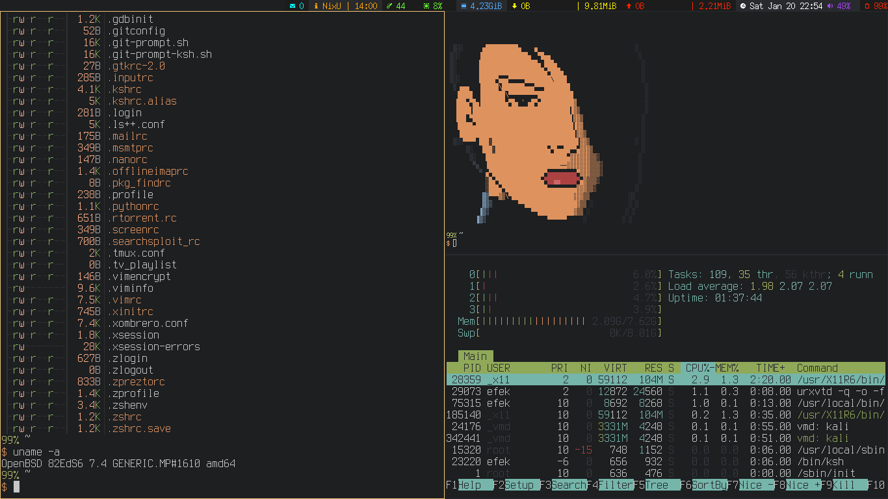
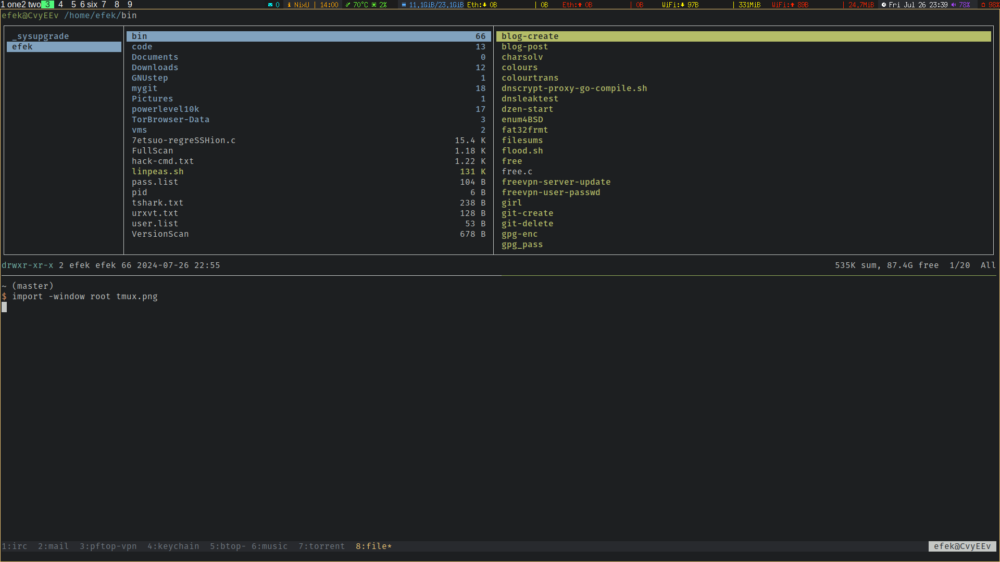
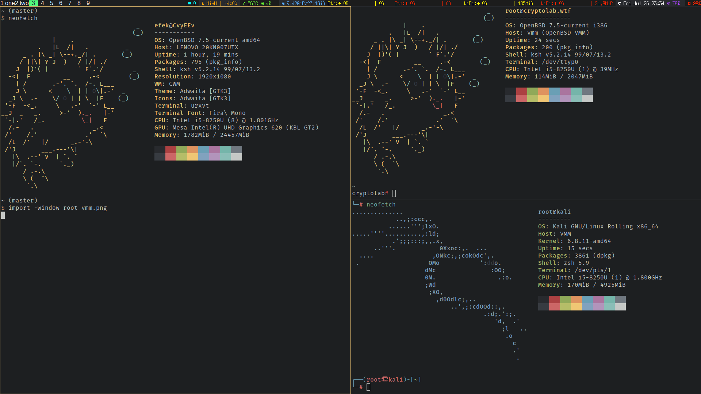

#Thinkpad e480
#OpenBSD-current
__________________________________________________________________________________
|WM/DE|SHELL    |TERM |Editor|FileManager|Multiplexer|Audio|Mail|IRC  |Monitor   |
|-----|---------|-----|------|-----------|-----------|-----|----|-----|----------|
|CWM  |ksh,fish |urxvt|vim   |ranger     |tmux       |cmus |mutt|irssi|conky,dzen|
----------------------------------------------------------------------------------

#Screenshots





# Configuration

## Add User to Group

```
# usermod -L staff efek
# usermod -G staff efek
```

# Crontab Configuration for Battery Low Warning

```
$ crontab -e
```

### Listing the scheduled jobs in Crontab:

```
$ crontab -l
```

### Deleting all jobs from the Crontab:

```
$ crontab -r
```

### This is a Crontab entry that will run every minute:

```
*/1 * * * * /home/efek/bin/checkbatt
```

# Local Proxy Setup 
ref: [solene](https://dataswamp.org/~solene/2023-12-31-hardened-openbsd-workstation.html)

### 1. Create a New User
First, create a new user named `_proxy`:

```
# useradd -s /sbin/nologin -m _proxy
```

### 2. Authorize SSH Key

Copy your SSH public key to the _proxy user's authorized keys file:

```
# cp id_rsa.pub /home/_proxy/.ssh/authorized_keys
```

### 3. PF Configuration

Edit the PF configuration file to block TCP and UDP protocols for the efek user:

```
# nano /etc/pf.conf
```

Content:

```
block return out proto {tcp udp} user efek
```

Then reload the PF configuration:

```
# pfctl -f /etc/pf.conf
```

### 4. SSH Configuration

Edit the SSH configuration file for the `efek` user:

```
$ nano /home/efek/.ssh/config
```

Content:

```
Host localhost
  User _proxy
  ControlMaster auto
  ControlPath ~/.ssh/%h%p%r.sock
  ControlPersist 60

Host *.*
  ProxyJump localhost
```

### 5. Establish SSH Tunnel

Now, establish an SSH tunnel to localhost as the `_proxy` user:

```
$ ssh -N -D 10000 _proxy@localhost
```

### 6. Configure Proxy Settings

Set the proxy settings for the system-wide configuration:

```
$ export all_proxy=socks5://localhost:10000
```

# ramdisk 

```
# mkdir /ramdisk
# chmod 1777 /ramdisk
```

### add /etc/fstab

`swap /ramdisk mfs rw,nodev,nosuid,-s=300m 0 0`

# unbound and dnscrypt

```
# rcctl enable unbound dnscrypt_proxy
# rcctl set unbound flags "-c /var/unbound/etc/myunbound.conf"
# rcctl start unbound dnscrypt_proxy
```

# Samba

### `exec dbus-launch --exit-with-session --sh-syntax cwm`

```
# pkg_add -Dsnap gvfs gvfs-smb dbus avahi
# rcctl enable multicast messagebus avahi_daemon
```

# vmm kali

```
$ vmctl create -s 60GB kali.qcow2
# vmcrl start -c -m 5G -L -i 1 -r kali-linux.iso -d kali.qcow2 kali
```

## tab

`console=ttyS0,9600n8`

### kali install ssh-server
