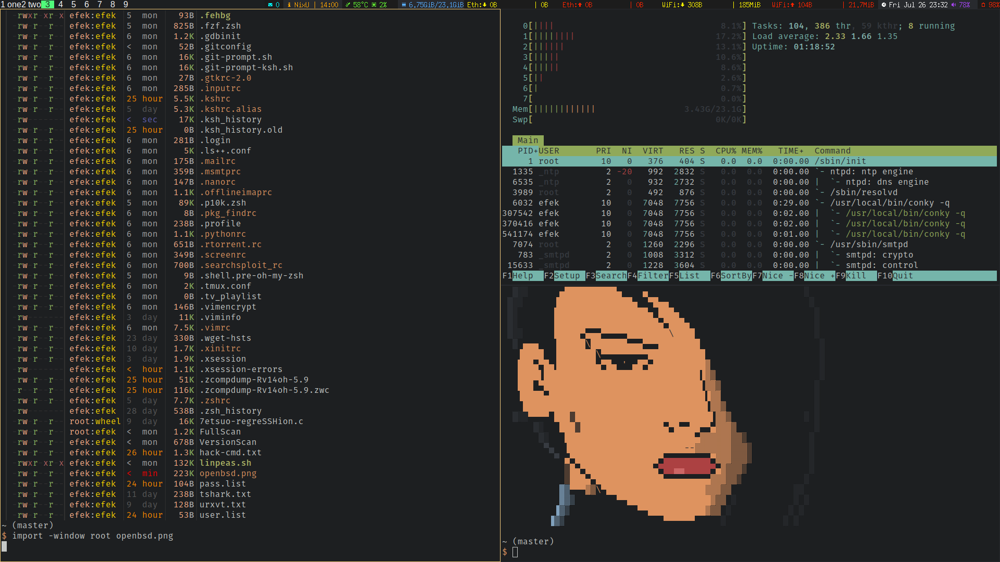

#Thinkpad e480
#OpenBSD-current
__________________________________________________________________________________
|WM/DE|SHELL    |TERM |Editor|FileManager|Multiplexer|Audio|Mail|IRC  |Monitor   |
|-----|---------|-----|------|-----------|-----------|-----|----|-----|----------|
|CWM  |ksh,fish |urxvt|vim   |ranger     |tmux       |cmus |mutt|irssi|conky,dzen|
----------------------------------------------------------------------------------

#Screenshots




# Configuration
## Add User to Group
```
# usermod -L staff efek
# usermod -G staff efek
```
